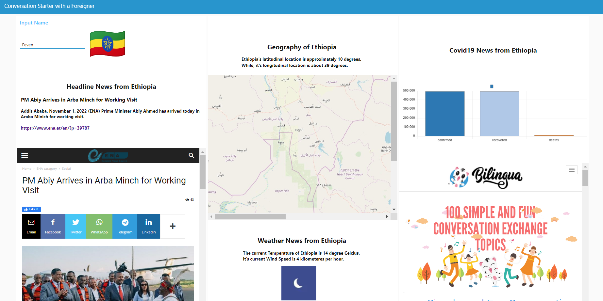

<h1>Brief Explanation about the Web Services Used</h1>

I have used a total of <strong>7 OpenAPIs</strong>, 1 Informative Website, 1 special node-red module, and 2 special node-red nodes for the successful implementation of this service:

<strong>Node-red-node-ui-iframe</strong>: - It allows one to embed other web pages within the node-red dashboard. It can also be used to embed images from other sites.&nbsp;

<strong>Node-Red-chart-node</strong>:- It can be used for displaying input information in the form of charts.&nbsp;

<strong>Node-red-dashboard:&nbsp;</strong>It allows the swift creation of webpages without the necessity of using HTML. Furthermore, it allows the use of other nodes within it to provide different features.

<strong>Nationalize API</strong>:- It takes in the name of an individual and predicts the nationality of the individual. It outputs the ISO3166-1 2-digit code of the country.

<strong>Flagpedia API:&nbsp;</strong>It takes in the ISO3166-1 2-digit code of a country in lowercase and gives out the image of a flag of the country.&nbsp;

<strong>NewsData API</strong>: It takes in the ISO3166-1 2-digit code of a country and outputs the headline news information of the input country with a reference webpage and short description for the headline news.

<strong>Geoapify API:-&nbsp;</strong>I utilized 2 different functions of the API:

<ol start="1">
    <li><strong>Geoapify Geocoding API:</strong>- It receives the country name as input and gives out the latitudinal and longitudinal information of the country.</li>
    <li><strong>Geoapify StaticMap API:- &nbsp;</strong>It receives the latitudinal and longitudinal information of a country and outputs a static map that displays the country on a map.&nbsp;</li>
</ol>

<strong>WeatherStack API</strong>:- It takes in the latitudinal and longitudinal information of a country and outputs the weather description of the country. Furthermore, it outputs an image link describing the weather condition of the country.

<strong>Covid19.mathdro.id API</strong>:- It takes in the country name and outputs the country&rsquo;s COVID-19 info.&nbsp;

<strong>Bilingua.io Website:&nbsp;</strong>A page I found helpful for starting conversations with new people. Reference:&nbsp;<a href="https://bilingua.io/100-simple-fun-conversation-exchange-topics">https://bilingua.io/100-simple-fun-conversation-exchange-topics</a>

<h1>Explanation about the Mashup Application</h1>

This mashup application is designed to assist in starting a conversation with a foreigner. Various pieces of research show that students studying abroad and ex-pats are at a very high risk of experiencing depression, and suggest interacting with others as the best way to beat depression. As a foreigner studying in Korea, I and many of my foreign friends experience difficulty beginning a conversation with a fellow foreigner, especially during our initial days after coming. This mashup application exactly tries to solve this problem by assisting in brainstorming various conversation starting points with a foreigner.

The application takes in the name of an individual through its UI, probably the name of a foreigner you just encountered. Then it predicts the country the individual came from based on his name using the nationalize.io API. Next, it uses the country name to display the flag and headline news of the country using the Flagpedia and Newsdata API, respectively. Then, it utilizes the Geoapify Geocoding API to get the longitudinal and latitudinal information of the country and displays the location of the country on a static map by using the Geoapify StaticMap API. The Geoapify StaticMap API accepts the longitudinal/latitudinal information from the Geocoding API to display the country’s geographical location on the static map, while the WeatherStack API displays the weather information using those inputs. Furthermore, the mashup also displays the Covid-19 information of the country graphically by making use of the covid19.mathdro.id API and the chart node of node-red. Finally, it frames another site with a list of interesting conversation topics.

The main aim of this mashup is to facilitate a smooth conversation with a foreigner you just met and only know his/her name and help fight depression, one of the main problems experienced in KAIST.

<h2>Sample Results:</h2>

<h2>References:</h2>
